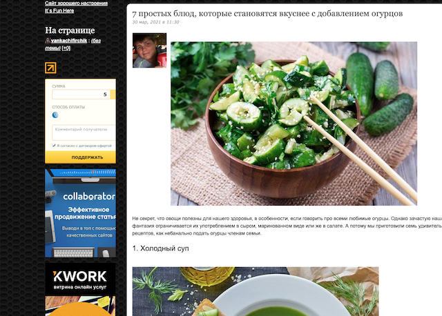

# Общие сведения

Экспериментальный сервис для очистки статей от рекламы и другого нежелательного контента.

# Использование

Функционал представлен в виде простой формы с единственным полем для ввода ссылки на нужную статью. В результате получим
контент в удобном, читабельном виде.

Проект развернут на [heroku](https://heroku.com) и доступен по ссылке
https://lit-retreat-84989.herokuapp.com/

Также есть возможность самому запустить проект на бесплатном хостинге heroku. Пример описан ниже.

# Heroku

Принципы описаны тут:
https://devcenter.heroku.com/articles/getting-started-with-go

Данный сервис уже готов развертке на heroku без дополнительной конфигурации, достаточно выполнить следующие шаги:

1. Зарегистрироваться https://signup.heroku.com/dc;
2. Установить клиент heroku https://devcenter.heroku.com/articles/getting-started-with-go#set-up;
3. Скачать проект себе ```git clone https://github.com/pokatovski/blog-parser.git```;
4. В папке с проектом выполнить ```heroku login```;
5. ```heroku create```;
6. ```git push heroku main```;
7. ```heroku open```.

# Пример 

До



После


